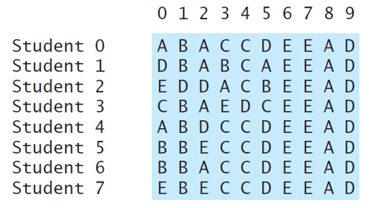
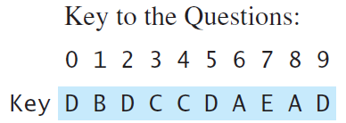
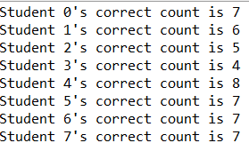

# Lab 1 - 2D Array

Grading a Multiple-Choice Test

1. Please write a program that grades multiple-choice tests. Assume there are eight students and ten questions, and the answers are stored in a two-dimensional array. Each row records a student's answers to the questions, as shown in the following array:

The key is stored in a one-dimensional array:

Your program grades the test and displays the result. It compares each student's answers with the key, count the number of correct answers, and display it.

The possible result that render on your console could be:

2. The method to submit your assignment.

Submit the .java file.