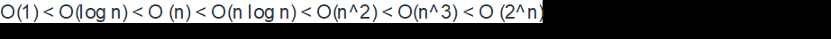

# Lab 8 - Determining Big O

A. Consider the time complexity for the following loops (8 pts):

1. O(n)
```
for (int i = 1; i <= n; i++) {

        k = k + 5;

}
```
2. O(n^2)

```
for (int i = 1; i <= n; i++) {

        for (int j = 1; j <= n; j++) {

                k = k + i + j;

        }

}
```

3. O(n^2)
```
for (int i = 1; i <= n; i++) {

        for (int j = 1; j <= i; j++) {

                k = k + i + j;

        }

}
```
4.
```
for (int i = 1; i <= n; i++) {

        for (int j = 1; j <= 20; j++) {

                k = k + i + j;

        }

}
```
B. Put the following growth functions in order (2 pts):

O(), O(log n), O( ), O(), O(n log n), O(1), O(n).




Example: put the two growth functions in order: O(1) and O(n)

Result should be: O(1) < O(n)


